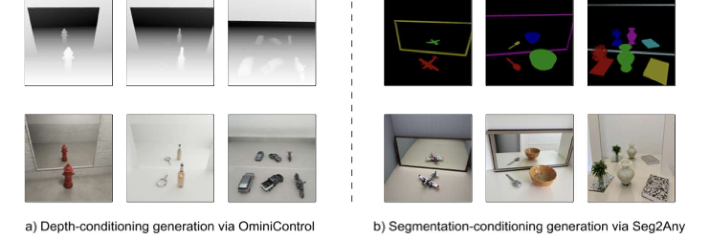

# PhysMirror

**PhysMirror: Physics-Informed Scene Modeling for Generating Mirror Reflections with Text-to-Image Diffusion Models**

*Accepted at IROS 2026*

[[Project Page]](https://t2i-mirror-object.github.io/site/) [[Paper]](<!-- TODO: add arXiv link -->)

<p align="center">
  
</p>

PhysMirror is a three-stage pipeline that generates photorealistic images with
physically plausible mirror reflections from text prompts. Unlike standard
text-to-image models that struggle with correct mirror geometry, PhysMirror
explicitly constructs a 3D scene with objects and a mirror, renders a
physics-based depth map, and uses it to condition a diffusion model for
high-quality image generation.

## Repository Structure

```
PhysMirror/
├── configs/
│   └── inference.yaml              # All pipeline parameters
├── data/
│   └── prompts.txt                 # Text prompts for batch inference
├── src/
│   ├── stage1_mesh/                # Text → 3D Mesh
│   ├── stage2_scene/               # Scene composition and depth rendering
│   └── stage3_generation/          # Depth-conditioned image generation
├── scripts/
│   ├── generate_depth_maps.py      # Batch Stage 1+2
│   └── generate_images.py          # Batch Stage 3
├── examples/
│   ├── run_full_pipeline.py        # End-to-end single-prompt demo
│   ├── run_stage2_scene.py         # Scene composition demo
│   ├── run_stage3_generation.py    # Image generation demo
│   └── sample_depth_map.png        # Sample input for Stage 3
├── eval/
│   ├── clip_score.py               # CLIP score evaluation
│   └── iqa_score.py                # No-reference IQA (CLIP-IQA, MANIQA, MUSIQ)
├── baseline/
│   ├── generate_flux.py            # FLUX baseline
│   └── generate_sdxl.py            # SDXL baseline
├── train_control_lora_flux.py      # LoRA training script
├── train_controlnet_flux.py        # ControlNet training script
├── utils/                          # Utility functions
├── TRELLIS/                        # Git submodule (Microsoft TRELLIS)
├── requirements.txt
└── requirements-sam.txt
```

---

## Prerequisites

- **OS**: Linux (tested on Ubuntu 20.04/22.04)
- **GPU**: NVIDIA GPU with at least 24 GB VRAM (tested on A100, A6000)
- **CUDA**: CUDA Toolkit 11.8 or 12.x
- **Python**: 3.8+
- **Conda**: Recommended for environment management

---

## Installation

1. **Clone the repository:**

    ```bash
    git clone --recurse-submodules https://github.com/T2I-Mirror-Object/PhysMirror.git
    cd PhysMirror
    ```

2. **Create a conda environment and install dependencies:**

    ```bash
    conda create -n physmirror python=3.10 -y
    conda activate physmirror
    pip install -r requirements.txt
    ```

3. **Set up the TRELLIS submodule** (for Stage 1 mesh generation):

    Follow the [TRELLIS installation guide](https://github.com/microsoft/TRELLIS#installation)
    to install its dependencies within the same environment.

4. **HuggingFace authentication** (required for FLUX model access):

    ```bash
    huggingface-cli login
    ```

---

## Quick Start

### Single-Prompt Example (End-to-End)

Run the full three-stage pipeline on a single text prompt:

```bash
python examples/run_full_pipeline.py \
    --prompt "A wooden chair" \
    --output_dir outputs/full_pipeline
```

This will:
- Generate a 3D mesh of the chair (Stage 1)
- Compose a mirror scene and render a depth map (Stage 2)
- Generate a photorealistic image with a mirror reflection (Stage 3)

Outputs are saved to `outputs/full_pipeline/`.

### Stage-by-Stage Examples

**Stage 2 only — Scene composition with a dummy object** (no model download needed):

```bash
python examples/run_stage2_scene.py \
    --shape cube \
    --camera_dist 2.2 \
    --camera_elevation 26 \
    --render_size 1024
```

**Stage 3 only — Generate an image from an existing depth map:**

```bash
python examples/run_stage3_generation.py \
    --depth_map examples/sample_depth_map.png \
    --prompt "A wooden chair in front of a mirror"
```

---

## Batch Inference

For processing a full dataset of prompts, use the batch scripts.
Edit `configs/inference.yaml` to configure parameters, then run:

**Step 1 — Generate depth maps (Stage 1 + Stage 2):**

```bash
python scripts/generate_depth_maps.py
```

**Step 2 — Generate images (Stage 3):**

```bash
python scripts/generate_images.py
```

Both scripts support slicing for parallelization across GPUs:

```bash
# GPU 0: prompts 0–99
CUDA_VISIBLE_DEVICES=0 python scripts/generate_depth_maps.py --start_idx 0 --end_idx 100

# GPU 1: prompts 100–199
CUDA_VISIBLE_DEVICES=1 python scripts/generate_depth_maps.py --start_idx 100 --end_idx 200
```

Both scripts resume safely — already-processed entries are skipped.

**Output structure:**

```
inference_result/
├── depth_maps/
│   ├── manifest.json
│   ├── depth_001.png
│   └── ...
└── images/
    ├── image_001.png
    └── ...
```

---

## Evaluation

**CLIP Score** (text-image alignment):

```bash
python eval/clip_score.py \
    --input_dir inference_result/images \
    --prompt "A wooden chair in front of a mirror" \
    --output_csv results/clip_scores.csv
```

**No-Reference IQA** (CLIP-IQA, MANIQA, MUSIQ):

```bash
python eval/iqa_score.py \
    --input_dir inference_result/images \
    --output_csv results/iqa_scores.csv
```

---

## Configuration

All pipeline parameters are defined in `configs/inference.yaml`:

| Section | Key parameters |
|---------|---------------|
| **Stage 1** | `mesh_model` (trellis/shap_e), `extractor` type |
| **Stage 2** | Mirror placement (`mirror_gap_*`), camera angles (`camera_dist`, `camera_elevation`, `camera_azim_*`), render resolution |
| **Stage 3** | FLUX model ID, LoRA weights, diffusion steps, guidance scale |

Refer to the comments in the config file for full documentation.

---

## Alternative Stage 3 Models

The primary pipeline uses FLUX + OminiControl depth conditioning. The codebase
also supports alternative Stage 3 models for experimentation:

- **Seg2Any**: Segmentation-conditioned generation (`src/stage3_generation/models/seg2any_wrapper.py`)
- **Multi-Condition**: Combined segmentation + depth conditioning (`src/stage3_generation/models/multi_condition.py`)
- **FLUX Depth + Trained LoRA**: Native FLUX depth model with custom LoRA (`src/stage3_generation/models/flux_depth.py`)

These models can be loaded via the factory function `get_t2i_model()`.

---

## Training

Training scripts for fine-tuning depth-conditioned models on custom datasets:

**Control LoRA training:**

```bash
python train_control_lora_flux.py \
    --pretrained_model_name_or_path black-forest-labs/FLUX.1-dev \
    --dataset_name <your-dataset> \
    --output_dir outputs/control-lora
```

**ControlNet training:**

```bash
python train_controlnet_flux.py \
    --pretrained_model_name_or_path black-forest-labs/FLUX.1-dev \
    --dataset_name <your-dataset> \
    --output_dir outputs/controlnet
```

Run with `--help` for full argument documentation.

---

## Baselines

Generate baseline images (without mirror-aware conditioning) for comparison:

```bash
# FLUX baseline
python baseline/generate_flux.py --prompt_file data/prompts.txt --output_dir outputs/baseline_flux

# SDXL baseline
python baseline/generate_sdxl.py --prompt_file data/prompts.txt --output_dir outputs/baseline_sdxl
```

---

## Citation

If you find this work useful, please cite our paper:

```bibtex
@inproceedings{physmirror2026,
    title     = {PhysMirror: Physics-Informed Scene Modeling for Generating Mirror Reflections with Text-to-Image Diffusion Models},
    author    = {<!-- TODO: add authors -->},
    booktitle = {IEEE/RSJ International Conference on Intelligent Robots and Systems (IROS)},
    year      = {2026}
}
```

---

## License

<!-- TODO: add license information -->
